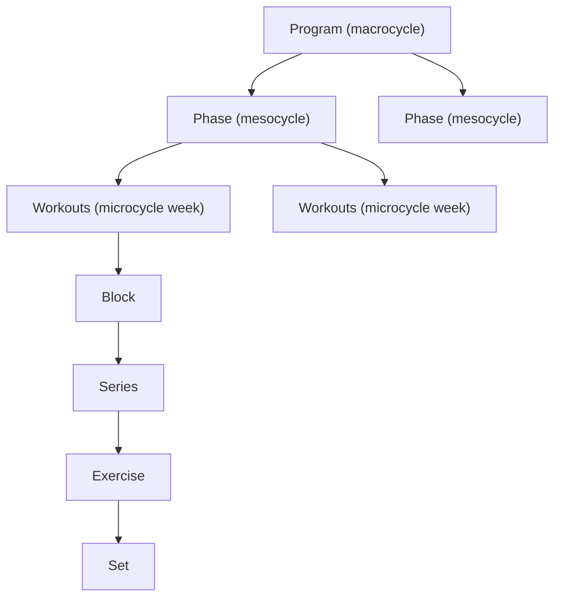

# Entities

OpenSet documents follow a strict hierarchical structure. This hierarchy is also how macro/meso/micro training cycles are represented (see [Program, phases, and training cycles](#program-phases-and-training-cycles) and [ACSM-style Mapping](./acsm-mapping)).

```
PROGRAM
  PHASE
    WORKOUT          <-- minimum valid standalone document
      BLOCK
        SERIES
          EXERCISE
            SET
```

Order of series within a block, exercises within a series, and sets within an exercise is given by **array index** (first element is first). There is no separate `order` field.

## Metadata

Workout and Program documents may include an optional `metadata` object for versioning and attribution (e.g. when selling programs). All fields are optional.

| Field | Description |
|-------|-------------|
| `version` | Content version (e.g. `"1.0.0"`, `"2024.02"`); distinct from `openset_version` (spec version). |
| `author` | Person or handle; attribution. |
| `provider` | Organization or brand publishing the content (same meaning as in libraries). |
| `license` | License identifier or URL (e.g. `"MIT"`, `"proprietary"`, `"CC-BY-4.0"`). |
| `created_at` | ISO 8601 date-time. |
| `updated_at` | Last modification time (ISO 8601 date-time). |

## Document Types

A valid OpenSet document is one of:

1. **Workout document** — A single training workout with `type: "workout"` (schema: `WorkoutDocument`)
2. **Program document** — A multi-phase training plan with `type: "program"` containing phases and workouts (schema: `ProgramDocument`)
3. **Exercise Library** — A collection of exercise definitions with `type: "exercise_library"`
4. **Workout Library** — A collection of reusable workout templates with `type: "workout_library"`
5. **Workout Execution** — Records what was done for a workout instance with `type: "workout_execution"` (schema: [workout-execution](https://openset.dev/schema/v1/workout-execution.schema.json)); see [Workout execution](/docs/spec/workout-execution).

## Levels

### Program

Top-level container for a multi-workout training plan.

| Field | Required | Description |
|-------|----------|-------------|
| `openset_version` | Yes | Spec version (e.g. `"1.0"`) |
| `type` | Yes | Must be `"program"` |
| `name` | Yes | Program name |
| `description` | No | Program description |
| `sports` | No | Target sports (freeform; common values include strength, running, cycling, swimming, fitness, yoga) |
| `duration` | No | Program duration object with numeric `value` and `unit` from `s|min|h|day|week` |
| `phases` | Yes | Array of Phase objects |
| `metadata` | No | Document metadata (see [Metadata](#metadata)) |
| `media` | No | Optional instructional or marketing videos and photos — same shape as [Exercise library](./exercise-library#media) (`videos`, `photos` with `url` and `label`; videos may include `language`) |

### Program, phases, and training cycles

Coaches and apps can represent classic **macro/meso/micro** cycles using the existing hierarchy:

- **Macrocycle** — The overall plan (e.g. multi‑month or year‑long season) is modeled as a single `Program` document.
- **Mesocycle** — Each `Phase` within `program.phases` typically represents a focused block of several weeks (e.g. hypertrophy, strength, peaking, deload).
- **Microcycle** — Weekly patterns of `Workout`s within a phase (e.g. push/pull/legs over one week) form a microcycle; progression comes from how workouts and set targets evolve week to week.

Phases already support time-bounded blocks via `week_start` and `week_end`, so a periodized program is usually:

```text
Program (macrocycle)
  Phase 1 — e.g. "Hypertrophy 1" (weeks 1–4)
  Phase 2 — e.g. "Strength 1" (weeks 5–8)
  Phase 3 — e.g. "Deload" (week 9)
  Phase 4 — e.g. "Strength 2" (weeks 10–12)
```

Within each phase, individual workouts encode microcycle structure (e.g. PPL, upper/lower, full‑body) and progression using set‑level dimensions such as `reps`, `load`, `rpe`, `duration`, and `rest_after`. See [Extensions](./extensions) for optional metadata fields that can label mesocycles and microcycles more explicitly.



### Phase

Groups workouts within a program by training focus or time period.

| Field | Required | Description |
|-------|----------|-------------|
| `name` | Yes | Phase name |
| `week_start` | No | Starting week number |
| `week_end` | No | Ending week number |
| `goal` | No | Phase objective |
| `workouts` | Yes | Array of Workout objects |

### Workout

The minimum valid standalone document. Represents a single training workout.

| Field | Required | Description |
|-------|----------|-------------|
| `openset_version` | Yes | Spec version |
| `type` | Yes | Must be `"workout"` |
| `name` | No | Workout name |
| `date` | No | ISO 8601 date |
| `sports` | No | Target sports (freeform; common values include strength, running, cycling, swimming, fitness, yoga) |
| `level` | No | Difficulty: `beginner`, `intermediate`, `advanced`, `elite` |
| `duration` | No | Estimated workout duration object with numeric `value` and `unit` from `s|min|h|day|week` |
| `tags` | No | Optional tags for filtering and discovery |
| `metadata` | No | Document metadata (see [Metadata](#metadata)) |
| `media` | No | Optional instructional or marketing videos and photos — same shape as [Exercise library](./exercise-library#media) (`videos`, `photos` with `url` and `label`; videos may include `language`). Applies to standalone workouts and to each workout embedded under a program phase. |
| `blocks` | Yes | Array of Block objects |

### Block

Groups related series within a workout (e.g., warm-up, main work, cooldown).

Blocks are the recommended way to model **warm-ups, main work, and finishers**:

- A typical strength workout might use:
  - Block 0: `"Warm-up"` — ramp-up sets, mobility, activation work
  - Block 1: `"Main work"` — primary lifts and accessories
  - Block 2: `"Finisher"` or `"Cool-down"` — conditioning or recovery work
- Warm-up sets are modeled as normal sets inside a `"Warm-up"` block; there is no special warm-up flag in the schema.
- Consumers (apps, UIs) are free to present or aggregate warm-up vs main blocks differently (e.g., collapsed warm-up, separate volume stats) while using the same underlying structure.

| Field | Required | Description |
|-------|----------|-------------|
| `name` | No | Block name |
| `series` | Yes | Array of Series objects |

### Series

A group of exercises performed with a specific execution mode.

| Field | Required | Description |
|-------|----------|-------------|
| `execution_mode` | Yes | How exercises flow (see [Execution Modes](./execution-modes)) |
| `rounds` | No | When present, how many times the series is repeated (e.g. for CIRCUIT, SUPERSET, AMRAP) |
| `rest_after` | No | Rest after the series |
| `exercises` | Yes | Array of Exercise objects |

### Exercise

A single exercise within a series.

| Field | Required | Description |
|-------|----------|-------------|
| `exercise_id` | One required | ID from an exercise library |
| `name` | One required | Freeform exercise name |
| `group` | No | Sub-group identifier (for CLUSTER mode) |
| `sets` | Yes | Array of Set objects |

### Set

The atomic unit — a single prescribed effort.

| Field | Required | Description |
|-------|----------|-------------|
| `dimensions` | Yes | Array of required dimension names (see [Dimensions](./set-dimensions)) |
| dimension fields | Varies | Values for each declared and optional dimension |
